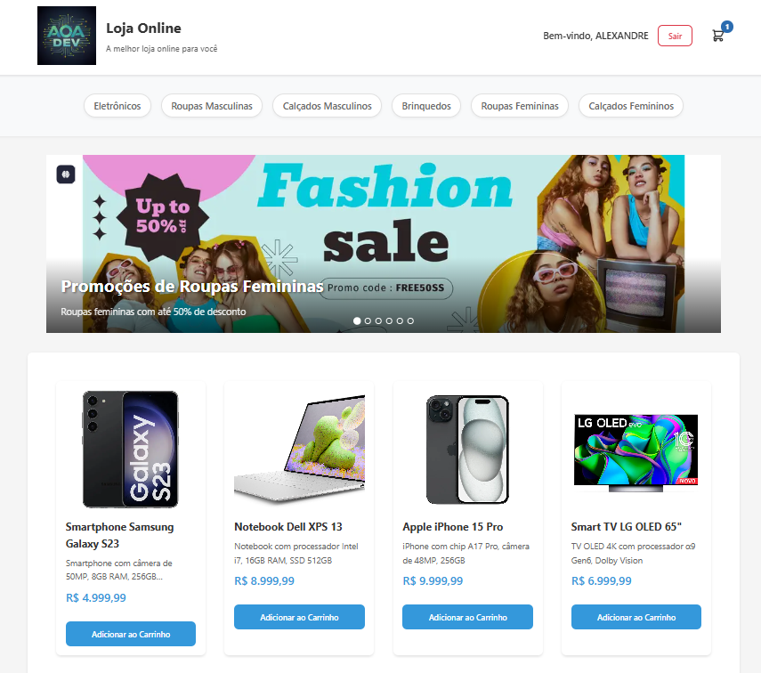
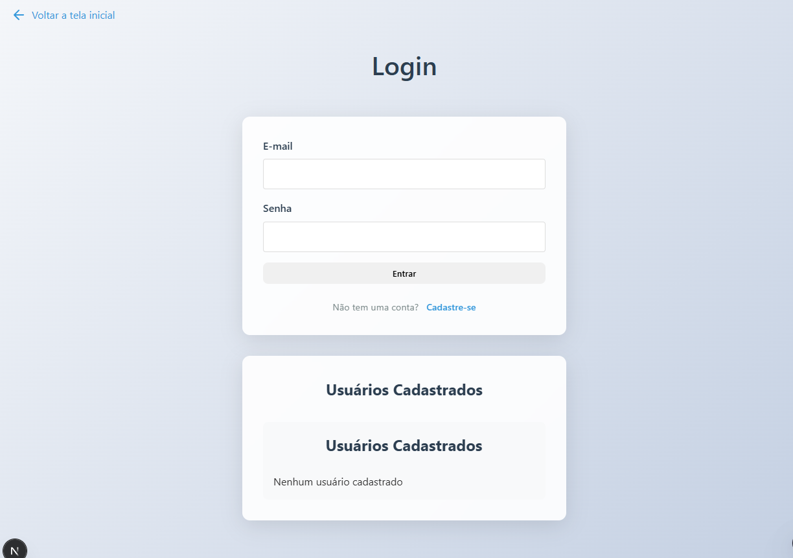
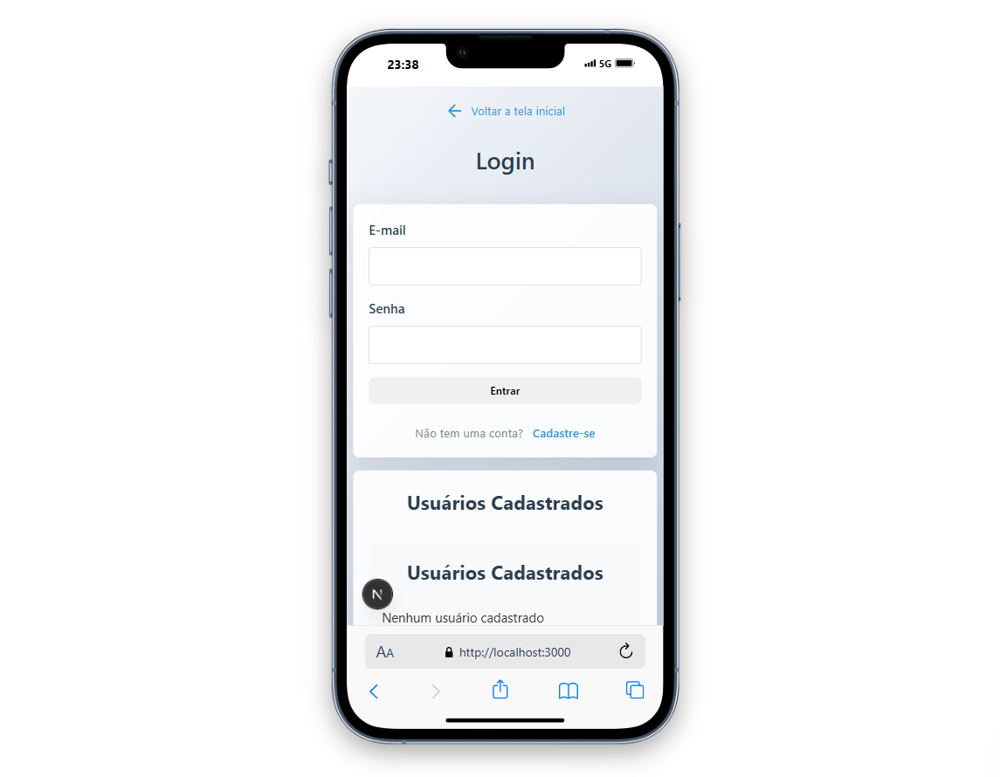
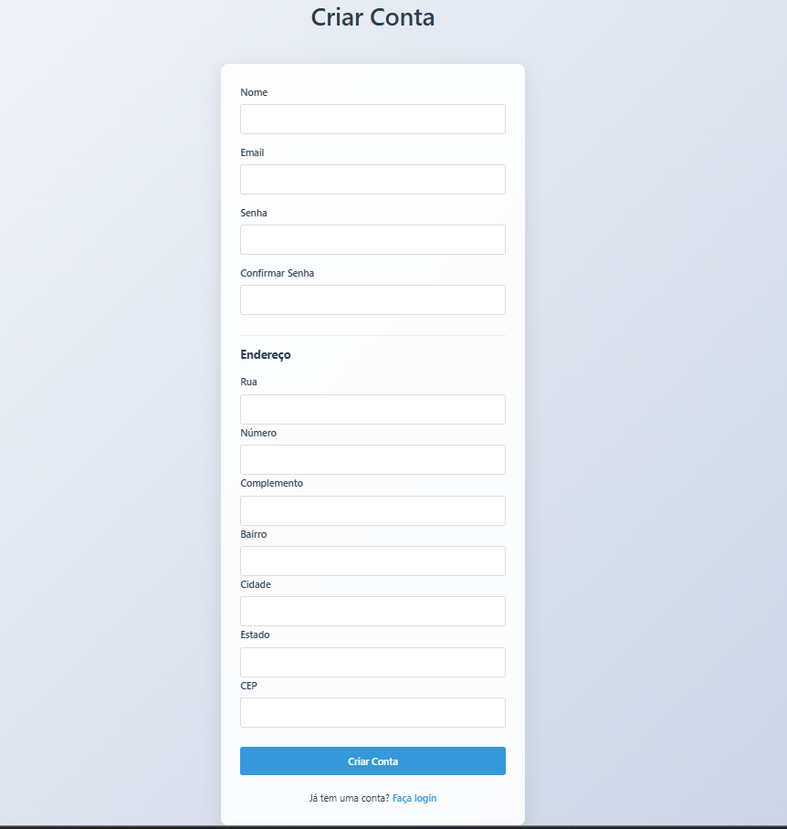
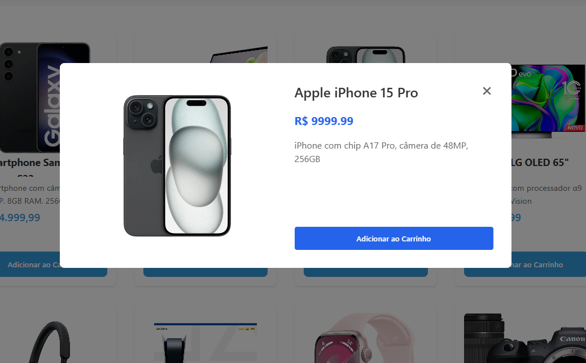
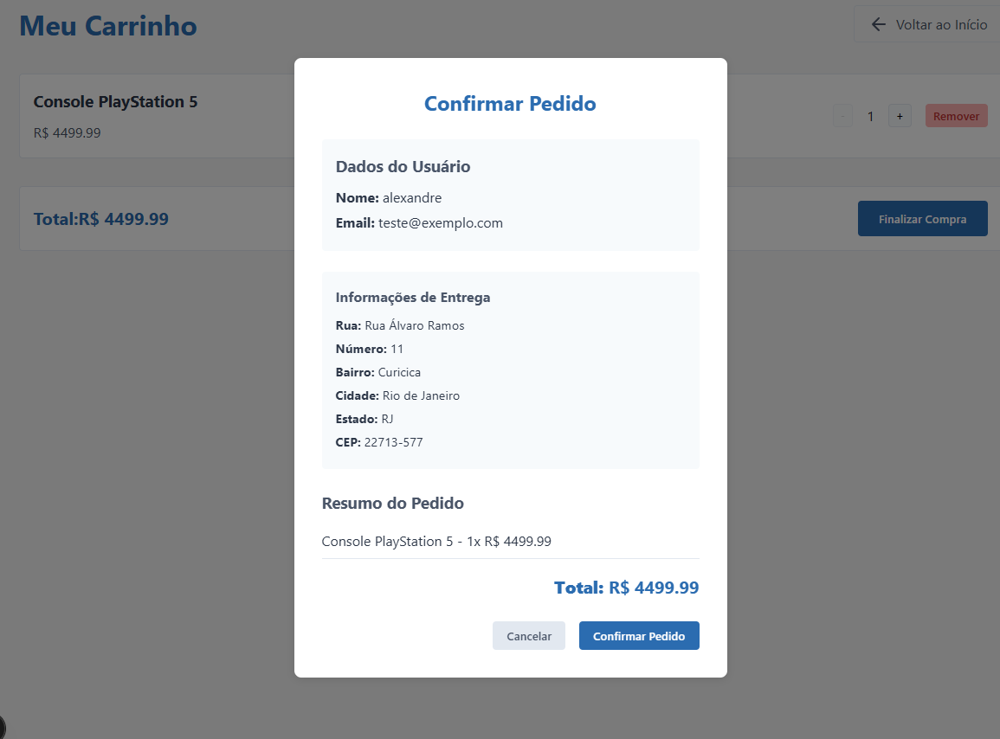
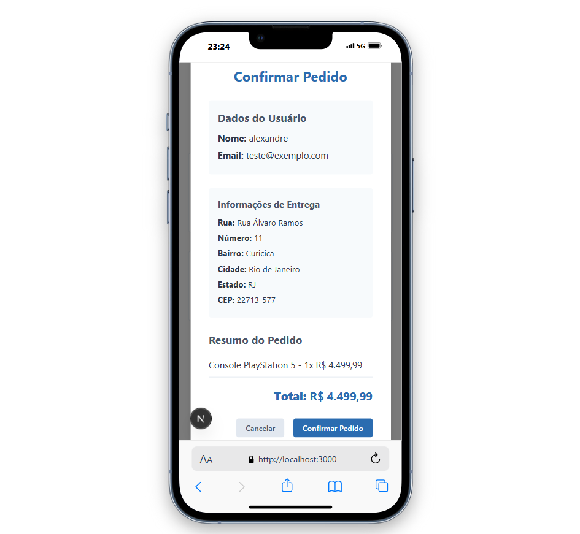

# Loja Online

Uma aplicação web moderna de e-commerce desenvolvida com Next.js, TypeScript e Supabase.

## 🚀 Tecnologias Utilizadas

- **Frontend:**

  - Next.js 15
  - TypeScript
  - React 19
  - CSS Modules
  - React Toastify (notificações)
  - Next/font (otimização de fontes)

- **Backend:**

  - Next.js API Routes
  - Supabase (PostgreSQL na nuvem)
  - bcryptjs (criptografia de senhas)

- **Ferramentas:**
  - ESLint (linting)
  - TypeScript (tipagem estática)

## 🛠️ Como executar o projeto

> **✅ Banco de dados já configurado!** O projeto usa Supabase com dados pré-carregados. **NÃO é necessário configurar arquivo .env ou banco de dados.**

### 📋 Pré-requisitos

- Node.js 18+ instalado
- npm ou yarn

### 🚀 Passos para executar:

1. **Clone o repositório:**

   ```bash
   git clone https://github.com/alexandre020285/Loja-Online.git
   cd Loja-Online
   ```

2. **Instale as dependências:**

   ```bash
   npm install
   ```

3. **Inicie o servidor de desenvolvimento:**

   ```bash
   npm run dev
   ```

4. **Acesse a aplicação:**
   - Abra o navegador em: `http://localhost:3000` (ou a porta indicada no terminal)
   - A aplicação estará funcionando com dados reais!

### 📊 Dados disponíveis:

- **64 produtos** em 6 categorias diferentes
- **2 usuários** de teste
- **2 endereços** cadastrados

## 📋 Funcionalidades

### 🛍️ **Produtos:**

- Catálogo completo com 6 categorias
- Filtragem por categorias
- Detalhes dos produtos
- Imagens e descrições

### 👤 **Autenticação:**

- Login e registro de usuários
- Gerenciamento de sessão
- Proteção de rotas
- Criptografia de senhas

### 🛒 **Carrinho de Compras:**

- Adição/remoção de produtos
- Ajuste de quantidades
- Cálculo automático de total
- Persistência do carrinho
- Modal de carrinho


## 📁 Estrutura do Projeto

```
Loja-Online-main/
├── src/
│   ├── app/
│   │   ├── api/              # Rotas da API (Supabase)
│   │   │   ├── products/     # API de produtos
│   │   │   ├── auth/         # API de autenticação
│   │   │   └── users/        # API de usuários
│   │   ├── components/       # Componentes React
│   │   │   ├── auth/         # Componentes de autenticação
│   │   │   ├── cart/         # Componentes do carrinho
│   │   │   ├── header/       # Cabeçalho
│   │   │   ├── productCard/  # Card de produto
│   │   │   └── productList/  # Lista de produtos
│   │   ├── contexts/         # Contextos React
│   │   ├── services/         # Serviços da aplicação
│   │   ├── cart/             # Página do carrinho
│   │   ├── categoria/        # Página de categorias
│   │   ├── login/            # Página de login
│   │   ├── register/         # Página de registro
│   │   ├── globals.css       # Estilos globais
│   │   ├── layout.tsx        # Layout principal
│   │   └── page.tsx          # Página inicial
├── docs/                     # Documentação do projeto
├── scripts/                  # Scripts de migração
├── public/                   # Arquivos estáticos
│   └── screenshots/          # Screenshots do projeto
└── package.json              # Dependências e scripts
```

## 🗄️ Banco de Dados (Supabase)

### ✅ **Configuração automática:**

- Banco PostgreSQL na nuvem
- 8 tabelas criadas automaticamente
- 64 registros pré-carregados
- Políticas de segurança configuradas
- **Credenciais já configuradas no código**

### 📊 **Tabelas disponíveis:**

- `eletronics` - Produtos eletrônicos
- `mensclothing` - Roupas masculinas
- `mensshoes` - Calçados masculinos
- `toys` - Brinquedos
- `womensclothing` - Roupas femininas
- `womenshoes` - Calçados femininos
- `users` - Usuários
- `address` - Endereços

## 🖼️ Screenshots do Projeto

<div align="center">

### Página Inicial




### Login




### Cadastro




### Carrinho


### Detalhes do Produto




### Fechamento do pedido




</div>

## 🚀 Scripts Disponíveis

```bash
npm run dev          # Inicia o servidor de desenvolvimento
npm run build        # Build para produção
npm run start        # Inicia o servidor de produção
npm run lint         # Executa o linter
```

## 📧 Contato

**Alexandre Alves** - alexandre0202dev@gmail.com

**Link do Projeto:** https://github.com/alexandre020285/Loja-Online

---

## ⚡ **Execução Rápida (3 comandos):**

```bash
git clone https://github.com/alexandre020285/Loja-Online.git
cd Loja-Online
npm install
npm run dev
```

**Acesse:** http://localhost:3000 e comece a usar! 🎉
