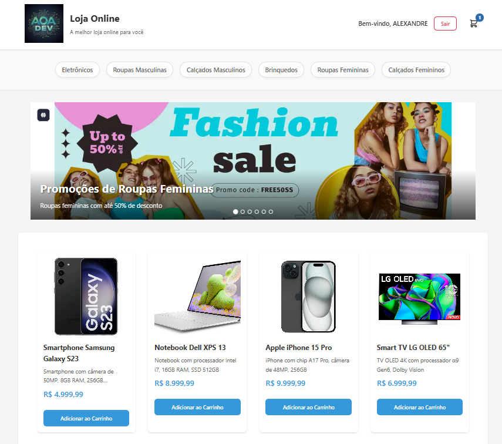
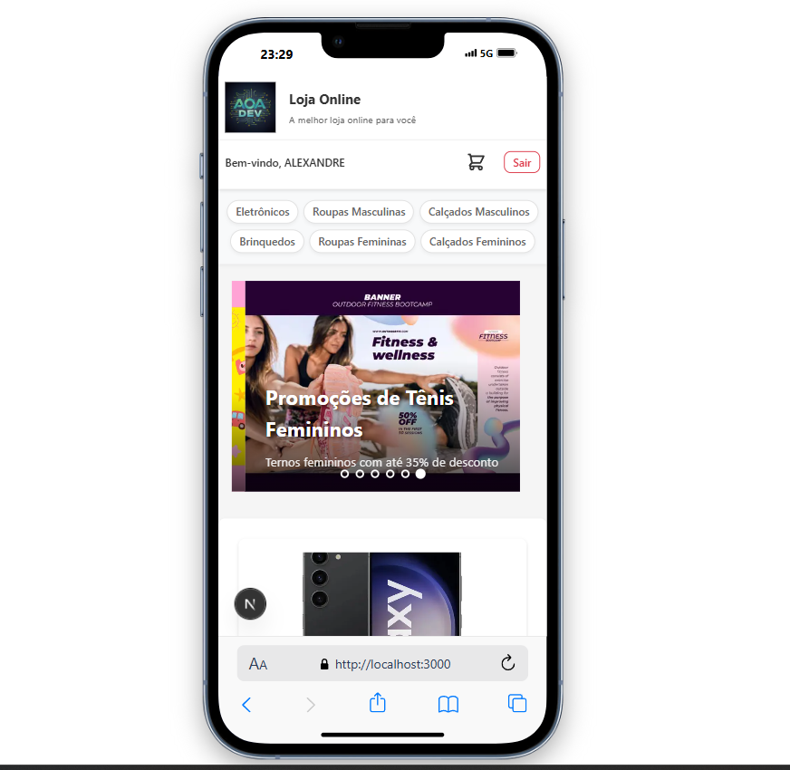
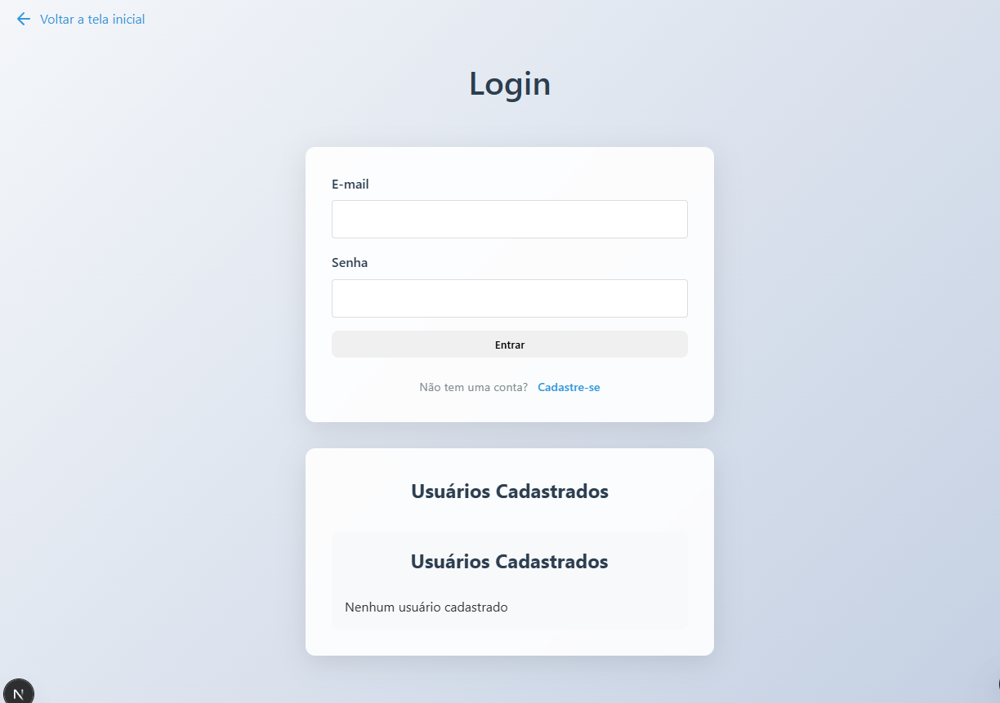
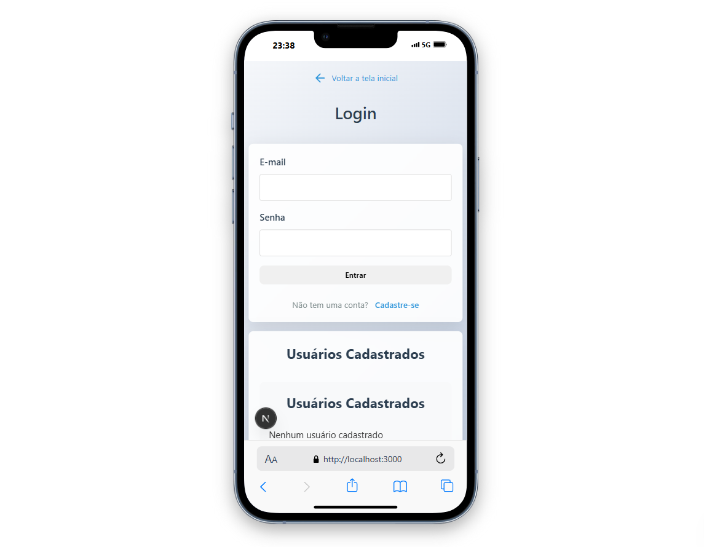
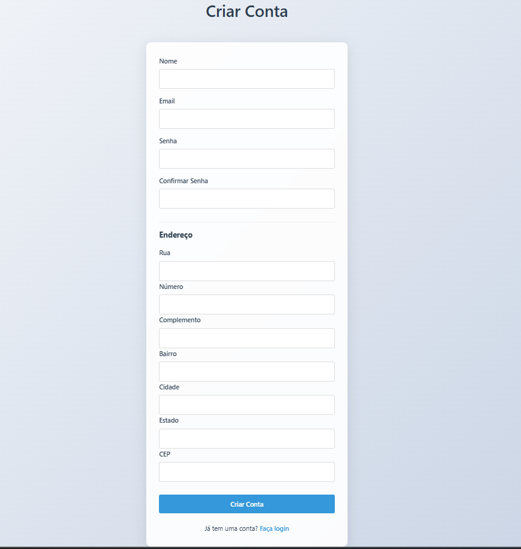
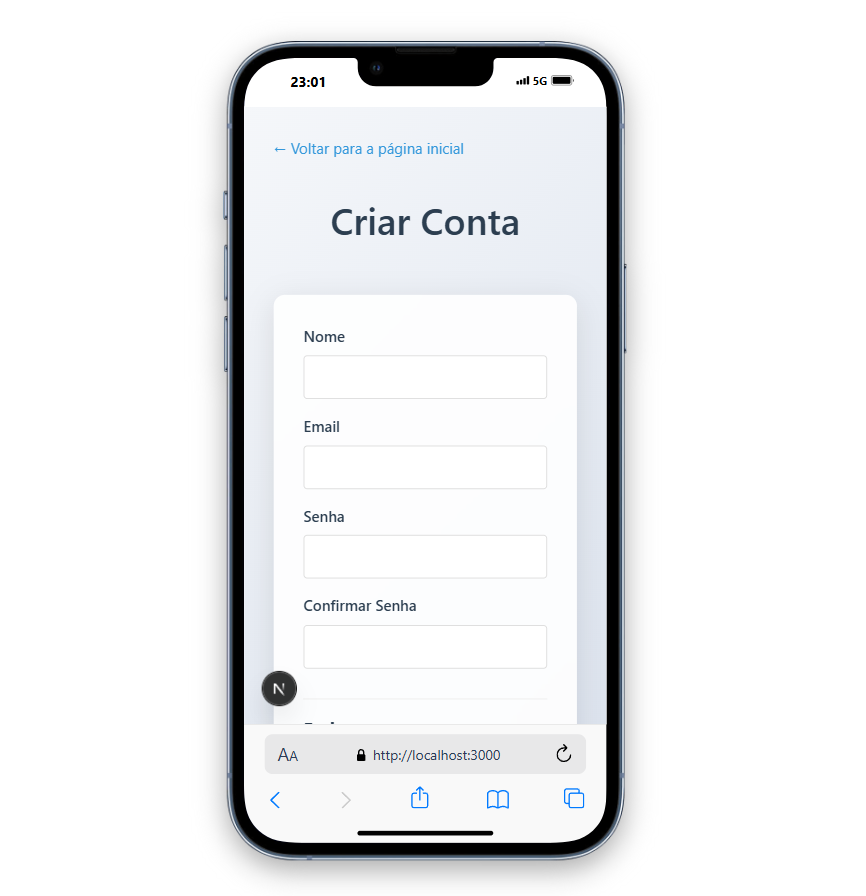
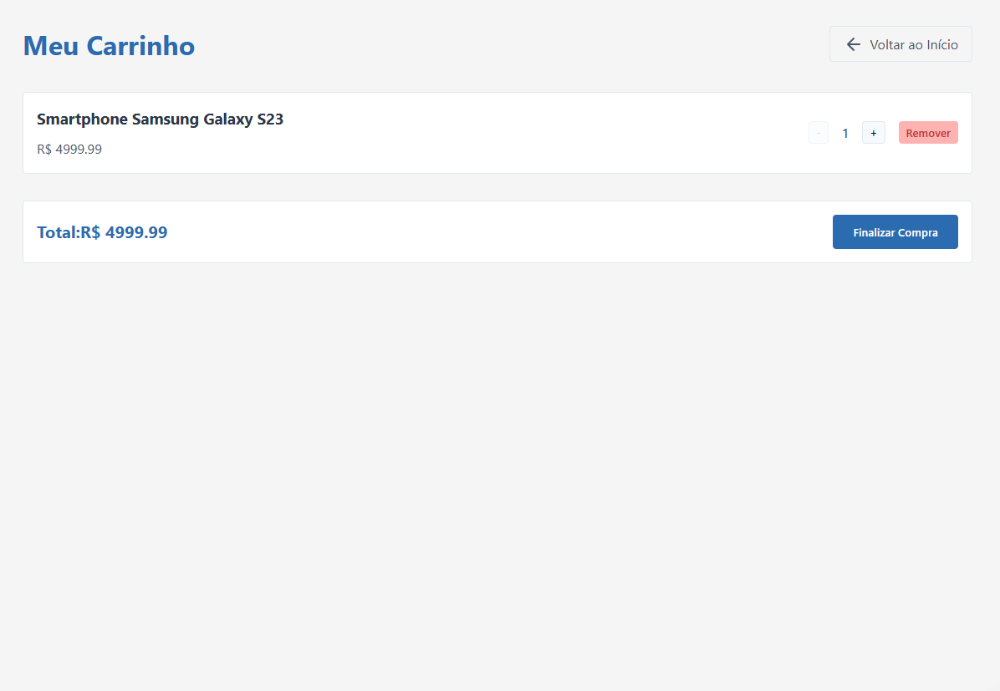
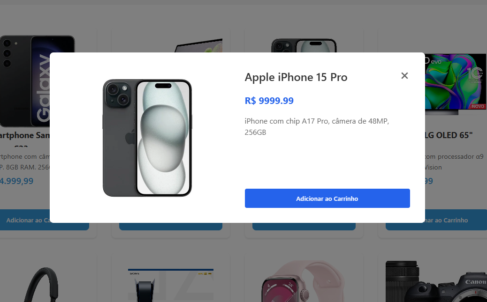
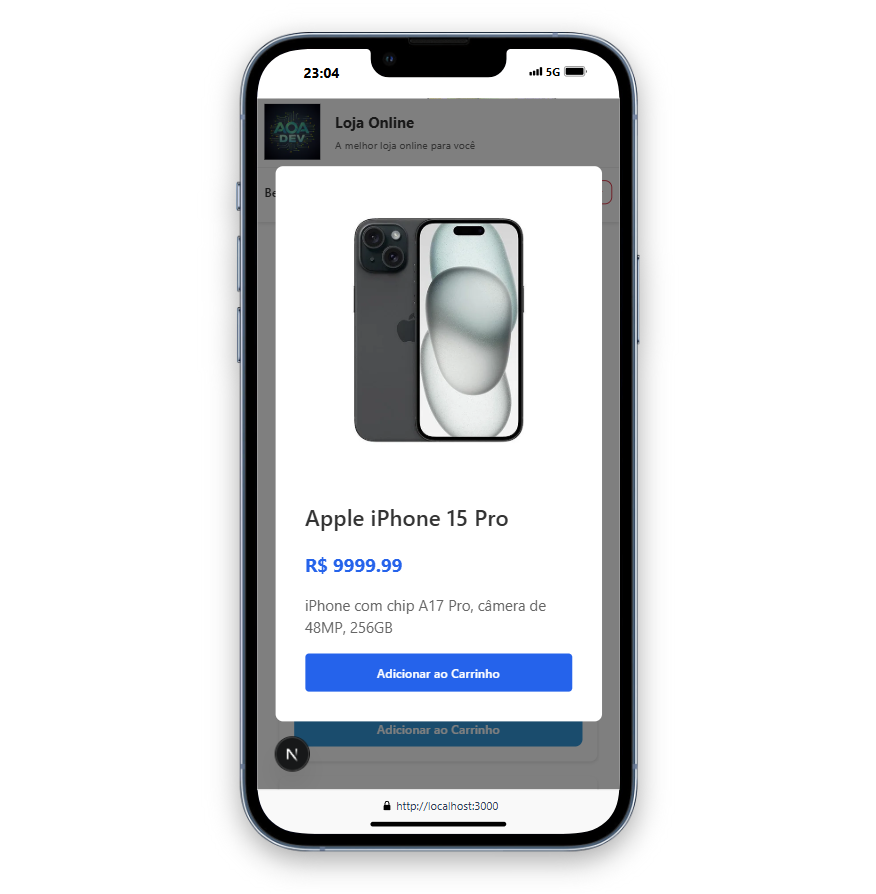

# Loja Online

Uma aplicação web moderna de e-commerce desenvolvida com Next.js, TypeScript e PostgreSQL.

## 🚀 Tecnologias Utilizadas

- **Frontend:**

  - Next.js 14
  - TypeScript
  - React
  - CSS Modules
  - React Toastify (notificações)
  - Next/font (otimização de fontes)

- **Backend:**

  - Next.js API Routes
  - Prisma ORM
  - PostgreSQL
  - JWT (autenticação)

- **Ferramentas:**
  - Prisma Studio (visualização do banco de dados)
  - ESLint (linting)
  - Prettier (formatação de código)

## 📋 Funcionalidades

- **Autenticação:**

  - Login e registro de usuários
  - Gerenciamento de sessão com JWT
  - Proteção de rotas
  - Recuperação de senha

- **Produtos:**

  - Catálogo de produtos
  - Filtragem por categorias
  - Busca de produtos
  - Detalhes do produto
  - Imagens dos produtos

- **Carrinho de Compras:**

  - Adição/remoção de produtos
  - Ajuste de quantidades
  - Cálculo automático de total
  - Persistência do carrinho
  - Modal de carrinho

- **Usuário:**
  - Perfil do usuário
  - Gerenciamento de endereços
  - Histórico de pedidos
  - Lista de desejos

## 📁 Estrutura do Projeto

```
src/
├── app/
│   ├── api/              # Rotas da API
│   │   ├── products/     # API de produtos
│   │   ├── users/        # API de usuários
│   │   └── cart/         # API do carrinho
│   ├── components/       # Componentes reutilizáveis
│   │   ├── auth/         # Componentes de autenticação
│   │   ├── cart/         # Componentes do carrinho
│   │   ├── header/       # Componente do cabeçalho
│   │   ├── menuCategory/ # Componentes de categorias
│   │   ├── productCard/  # Card de produto
│   │   └── productList/  # Lista de produtos
│   ├── contexts/         # Contextos React
│   ├── services/         # Serviços da aplicação
│   ├── cart/             # Página do carrinho
│   ├── categoria/        # Página de categorias
│   ├── login/            # Página de login
│   ├── products/         # Página de produtos
│   ├── register/         # Página de registro
│   ├── globals.css       # Estilos globais
│   ├── layout.tsx        # Layout principal
│   └── page.tsx          # Página inicial
├── prisma/               # Configuração do Prisma
│   └── schema.prisma     # Schema do banco de dados
└── public/               # Arquivos estáticos
    └── screenshots/      # Screenshots do projeto
```

## 🖼️ Screenshots do Projeto

<div align="center">

### Página Inicial




### Login




### Cadastro




### Carrinho




### Detalhes do Produto




### Fechamento do pedido


</div>

## 📧 Contato

Seu Nome - [@seu-twitter](https://twitter.com/seu-twitter) - email@exemplo.com

Link do Projeto: [https://github.com/seu-usuario/loja-online](https://github.com/seu-usuario/loja-online)
